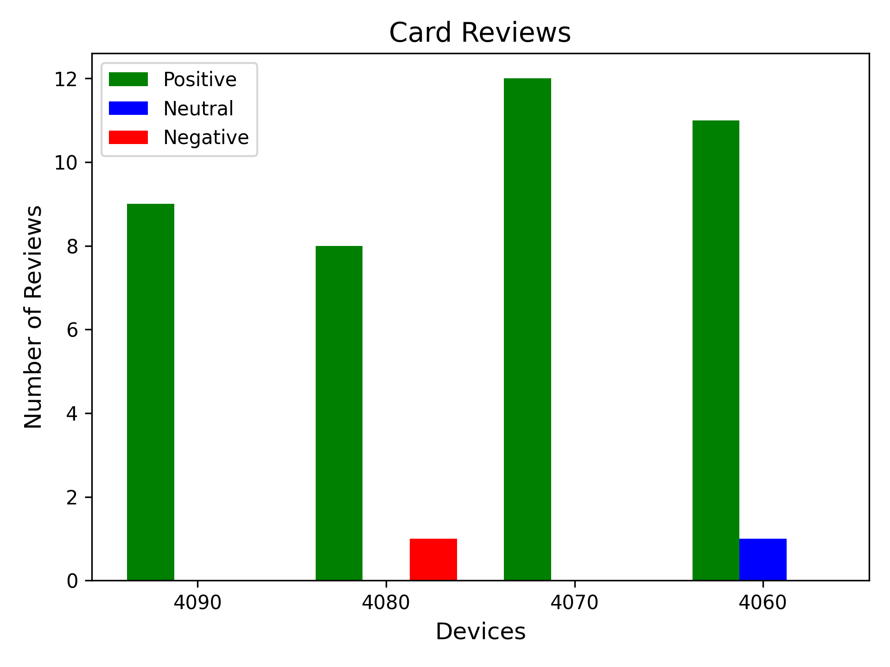

# Language Model Review Analyzer

This project automates the analysis of user reviews using the Phi 3.5 Mini language model. It processes input files containing review prompts, determines the sentiment of each comment (Positive, Neutral, or Negative), and saves the output to a file. The results are visualized in a bar chart comparing the sentiment distributions for different devices.

# Features

* Processes textual input using the Phi 3.5 Mini Instruct language model.
* Automatically installs the required model if not already available.
* Outputs sentiment classifications (Positive, Neutral, Negative) for each comment.
* Tracks and counts sentiment types.
* Generates a bar chart visualizing sentiment distribution across devices.

# Dependencies
The program requires the following Python libraries:

*  Pytorch
*  transformers (from HuggingFace)
*  matplotlib
These dependencies can be installed via pip or Conda.

# How to use
*  To download the packages used for the project, use the given yaml file and use "pip install -r requirements.yaml". 
*  The default settings on the program takes the outputs from Webscraper.py as the input files. To change the name or add more files, please check the Webscraper README for more details.
*  Once the Webscraper program runs, the LanguageModel program will be ready to run. If more output files are made, make sure to create more objects at the bottom of the program.

# Notes
* The old version of this program made no use of classes, making the code take longer and very repetitive. This new program makes use of OOP and classes to fix this issue and makes the code more readable and easier to update
* This version of the program should follow O and D of the SOLID principles.

# Review Plot

